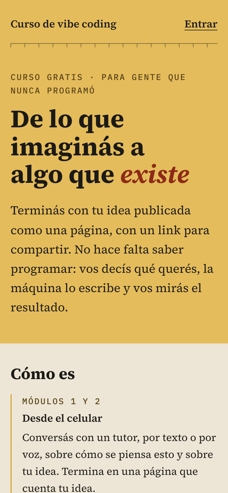
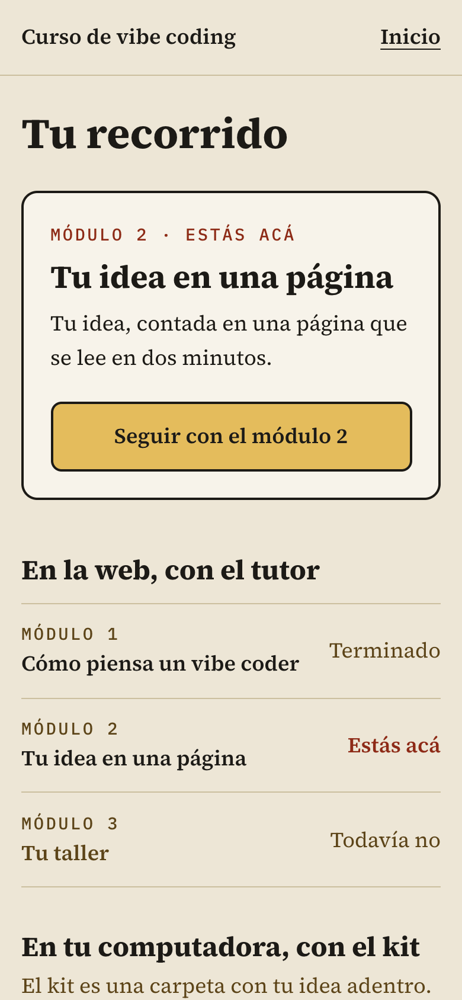
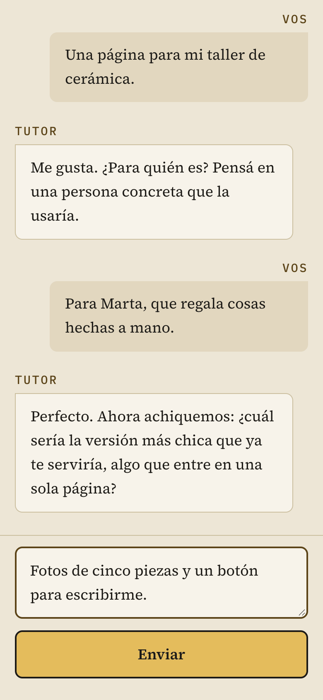
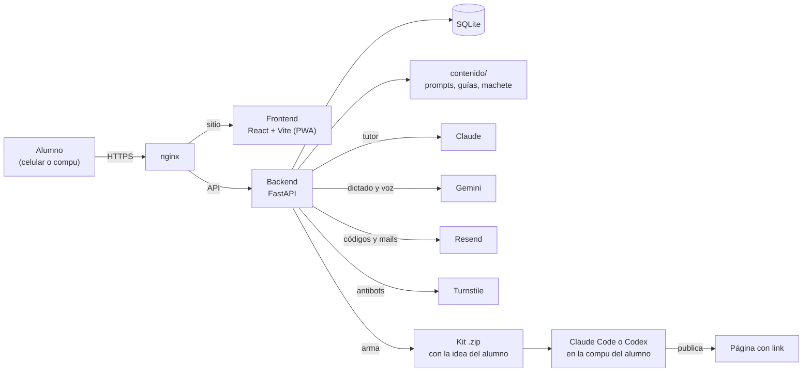

# Tutor de vibe coding

**De lo que imaginás a algo que existe.** Un curso gratis y de código abierto en el que un tutor de
IA lleva a gente que nunca programó desde una idea hasta una página propia, publicada y con un
link para compartir.

[](https://github.com/smartfoods1/tutor-vibe-coding/actions/workflows/tests.yml)
[](LICENSE)
[](LICENSE-CONTENIDO)
[](https://github.com/github/spec-kit)

- **¿Querés hacer el curso?** Todavía no abrió la inscripción: para enterarte, seguí a
  [@specialandres](https://www.instagram.com/specialandres/). Este repositorio es para quien quiere
  verlo por dentro, darlo en su comunidad o mejorarlo.
- **¿Querés verlo andar?** [En 5 minutos](#probalo-en-5-minutos) lo tenés en tu compu, sin claves
  de API y sin gastar nada.
- **¿Querés darlo con tu nombre?** [Adaptalo](docs/adaptar-el-curso.md) y
  [desplegalo](docs/desplegar.md) en tu servidor.

**Estado:** en prueba con los primeros alumnos; los tiempos y los costos del recorrido se están
midiendo.

<p align="center">
  
  
  
</p>

Está en español rioplatense, pensado primero para el celular y armado para que cualquiera lo
forkee y dé su propio curso: el código, el contenido, la investigación que lo sostiene y la
especificación completa están acá.

## Qué es y para quién

El curso tiene dos partes. En la **web**, un tutor que conversa por texto o por voz te explica qué
es el vibe coding (construir conversando con una IA), te entrevista hasta dejar tu idea en una
página y te acompaña a instalar tu herramienta. Después bajás un **kit**: una carpeta con tu idea
adentro que, abierta en Claude Code o en Codex, convierte a esa herramienta en tu tutor mientras
construís y publicás.

Sirve si sos:

- **Alguien que quiere dar un curso a su comunidad.** Cambiás el nombre, los colores, los textos y
  los datos de tu país, y lo desplegás en tu servidor con dos scripts.
- **Dev con curiosidad por los tutores con IA.** Hay un tutor con Claude que usa herramientas y
  responde por streaming, voz con Gemini (dictado y respuesta hablada), topes de costo por alumno y
  por mes, y un kit que hace de tutor dentro de un agente de código.
- **Docente.** El recorrido, sus principios pedagógicos y los informes de investigación con sus
  fuentes están escritos para leerse, discutirse y adaptarse.

## Probalo en 5 minutos

Con el modo demo el tutor responde con un guion fijo: no hacen falta claves de API, no se gasta
nada y la voz queda apagada. Necesitás git, [uv](https://docs.astral.sh/uv/) (si no tenés Python
3.12, lo baja solo) y Node 22.22.2 o más nuevo, 24.15 o más nuevo, o 26. En Windows, hacelo dentro
de WSL. ffmpeg solo hace falta para la voz y sus tests.

```bash
git clone https://github.com/smartfoods1/tutor-vibe-coding.git tutor-vibe-coding   # o la URL de tu fork
cd tutor-vibe-coding/backend
uv venv --python 3.12 .venv && uv pip install --python .venv -e ".[dev]"
cat > .env.local <<EOF
JWT_SECRET=$(openssl rand -hex 32)
ADMIN_EMAIL=vos@example.com
MAIL_FROM="Curso local <curso@example.com>"
DOMINIO=localhost:5173
DATA_DIR=./data
CONTENIDO_DIR=../contenido
TAREAS_ACTIVAS=false
DEV_CODIGO_FIJO=123456
MODO_DEMO=true
EOF
VIBE_ENV_FILE=.env.local .venv/bin/uvicorn --factory vibe_tutor.main:crear_app --port 8000
```

En otra terminal, desde la carpeta en la que corriste el `git clone`:

```bash
cd tutor-vibe-coding/frontend
npm ci && npm run dev
```

Abrí <http://localhost:5173>, inscribite con cualquier mail y, cuando te pida el código, poné
`123456` (`DEV_CODIGO_FIJO` solo funciona desde tu propia compu; nunca lo pongas en un servidor).
Arriba vas a ver la franja «Modo demo»: el tutor hace preguntas fijas, arma tu idea en una página y
te deja recorrer los módulos 1 a 3 completos. Entrando con el mail de `ADMIN_EMAIL` ves el panel en
`/admin`. Más detalles, tests y cómo probar con el tutor de verdad en
[docs/desarrollo-local.md](docs/desarrollo-local.md).

## Cómo funciona

Siete módulos, con una estimación de unas 5 horas repartidas en varios días (se está midiendo).
Los tres primeros pasan en la web, con el tutor; los cuatro últimos, en la computadora del alumno,
con el kit.

| Módulo | Dónde | Qué se lleva el alumno |
|---|---|---|
| 1. Cómo piensa un vibe coder | Web, desde el celular, por texto o voz | Qué es y qué no es el vibe coding, sus miedos con nombre y la semilla de su idea |
| 2. Tu idea en una página | Web, desde el celular | "Mi idea en una página": para quién es, por qué le importa, la versión más chica que ya vale la pena y qué queda para después |
| 3. Tu taller | Web, desde la computadora | Su herramienta elegida (Codex o Claude Code) según lo que ya tiene, instalada con ayuda (puede mandar capturas) y el kit descargado |
| 4. Primera victoria | Kit, en Claude Code o Codex | Su idea andando y publicada con un link en la primera sesión |
| 5. Construir | Kit | La página mejorada paso a paso: antes de cada pedido anota qué espera ver y después lo compara |
| 6. Cuando se rompe | Kit | Volver a una versión anterior y leer un error como información |
| 7. Terminar y mostrar | Kit y web | La versión final publicada y el link registrado en la web (con galería opcional) |

Cada módulo puede abrir con un audio corto de quien da el curso. El mapa completo, con el porqué
de cada decisión, está en [contenido/curriculo.md](contenido/curriculo.md).



## Lo que lo hace distinto

- **Pedagogía basada en evidencia, con sus límites a la vista.** Diez principios de diseño, cada
  uno con la fuerza de la evidencia que lo sostiene, a partir de cinco informes con fuentes
  verificadas en [contenido/investigacion/](contenido/investigacion/). Donde no hay evidencia para
  este público (adultos que nunca programaron), el currículo lo dice y lo marca como apuesta a
  medir.
- **Costo por alumno con topes.** Solo los módulos 1 a 3 usan la IA de quien da el curso; los 4 a
  7 corren en el plan de cada alumno. Hay un tope por alumno y uno mensual (por defecto, US$1 y
  US$50), un aviso al 80% y, al llegar al tope, el alumno sigue con la guía escrita sin perder su
  avance. El panel `/admin` muestra el embudo y el gasto del mes.
- **Datos mínimos y borrables.** Se entra con el mail y un código de un solo uso, sin contraseña.
  Cada alumno ve, descarga y borra todos sus datos cuando quiere. Las capturas de pantalla y los
  audios del dictado no se guardan, y las conversaciones se borran solas 30 días después de terminar
  cada módulo (las de un módulo sin terminar, a los 12 meses sin actividad).
- **Un kit que convierte a Claude Code o Codex en tutor.** Instrucciones cortas, lecciones que se
  cargan solo cuando hacen falta, una bitácora para retomar y versiones como red de seguridad. Las
  instrucciones le prohíben al agente tocar nada fuera de la carpeta, instalar sin permiso o pedir
  contraseñas. En Claude Code, además, el kit endurece los permisos desde su propia carpeta: pide
  permiso antes de cada comando y niega `sudo` y `rm -rf`.
- **Datos fechados.** Precios, planes y pasos de instalación viven en un solo archivo, con fuente
  oficial y fecha de verificación. Nada dice "gratis" si no se probó de verdad (hay un test que lo
  impide) y el panel avisa cuando un dato lleva más de 45 días sin verificar.
- **Seguridad desde el principio.** Política de contenido (CSP) estricta sin scripts en línea,
  cookie de sesión `__Host-` (HttpOnly, Secure, SameSite=Strict), protección contra pedidos de
  otros sitios, antibots opcional con Cloudflare Turnstile, límites de códigos por mail, por IP y
  por día, y un tutor que trata el texto pegado y las capturas como datos, nunca como órdenes.
- **Probado.** Más de 700 tests (backend, contenido y frontend) que no llaman a ningún servicio
  pago; GitHub Actions los corre en cada pull request, también en los que vienen de forks.

## Stack

| Parte | Con qué |
|---|---|
| Backend | Python 3.12, FastAPI, SQLite en modo WAL, SDK de Anthropic, httpx, pytest |
| Frontend | React 19, TypeScript, Vite, Tailwind 4, react-markdown, PWA, Vitest |
| IA | Claude (tutor), Gemini (dictado y voz) |
| Servicios | Resend (mails), Cloudflare Turnstile (antibots, opcional) |
| Kit | Markdown y HTML, para Claude Code (app de escritorio de Claude) y Codex (app de escritorio de ChatGPT) |
| Servidor | Linux con systemd, nginx y certificados de Let's Encrypt |
| Diseño | [spec-kit](https://github.com/github/spec-kit): la constitución en [.specify/memory/constitution.md](.specify/memory/constitution.md) y la especificación, el plan, los contratos (incluida la [API](specs/001-curso-vibe-coding/contracts/api.md)) y las tareas en [specs/](specs/) |

En el código y en el servidor el proyecto se llama `vibe-tutor`. El nombre que ven los alumnos lo
elegís con `VITE_NOMBRE_CURSO` (por defecto, «Curso de vibe coding»).

```text
backend/       API, tutor, voz, mails, armado del kit y tests
frontend/      la web (PWA)
contenido/     todo lo que ve el alumno: prompts, guías, kit, machete, mails, textos legales
  investigacion/   los informes con fuentes que sostienen el currículo
deploy/        scripts de despliegue, plantilla de nginx y servicio de systemd
docs/          guías para desarrollar, desplegar y adaptar el curso, y las capturas
specs/         especificación del proyecto (spec-kit)
```

## Adaptalo a tu curso

Casi todo se cambia sin tocar código. La guía paso a paso está en
[docs/adaptar-el-curso.md](docs/adaptar-el-curso.md):

1. Las líneas de ayuda y el número de emergencias de tu país.
2. Los textos legales de tu país (los que vienen son borradores para Argentina).
3. El nombre del curso, quién lo da y tu newsletter, si tenés.
4. Colores e íconos.
5. El machete: los datos que se vencen, con fuente y fecha.
6. El contenido de los módulos y del kit.
7. Tus audios, si querés grabarlos.
8. La zona horaria, si no estás en Argentina.

## Desplegalo

Necesitás un servidor Linux, un dominio y claves de Anthropic, Google AI Studio y Resend (y, si
querés antibots, de Cloudflare Turnstile). Un script prepara el servidor una vez (usuario,
carpetas, nginx, certificado con certbot y la configuración) y otro despliega desde tu compu con
tests, subida, recarga de nginx con vuelta atrás si algo falla y chequeos de humo por HTTPS. Todo
en [docs/desplegar.md](docs/desplegar.md).

## Contribuir

Las mejoras son bienvenidas, sobre todo las de contenido con su fuente. Leé
[CONTRIBUTING.md](CONTRIBUTING.md) y el [código de conducta](CODE_OF_CONDUCT.md). Las dudas sobre
cómo usar, adaptar o desplegar el curso van en [Discussions](https://github.com/smartfoods1/tutor-vibe-coding/discussions). Para
reportar un problema de seguridad, seguí [SECURITY.md](SECURITY.md) y no abras un issue público.

## Licencias

| Qué | Licencia |
|---|---|
| Código: `backend/`, `frontend/`, `deploy/`, `.github/` y los tests | [MIT](LICENSE) |
| Contenido del curso y documentación de diseño: `contenido/` (salvo `kit/`, `ejemplos/` y `machete.yaml`), `specs/`, `.specify/memory/`, `docs/` | [CC BY 4.0](LICENSE-CONTENIDO) |
| `contenido/kit/`, `contenido/ejemplos/` y `contenido/machete.yaml` (viaja en cada kit): la carpeta y la página de cada alumno son suyas | [CC0 1.0](contenido/kit/LICENCIA.txt) |
| Archivos de spec-kit en `.specify/` (salvo `memory/`) y `.claude/skills/` | MIT de GitHub, Inc. ([avisos](THIRD_PARTY_NOTICES.md)) |

Las tipografías, las dependencias y ffmpeg conservan sus licencias: ver
[THIRD_PARTY_NOTICES.md](THIRD_PARTY_NOTICES.md). La licencia del contenido no cubre el nombre, la
voz ni la identidad del autor: si adaptás el curso, va con tu nombre.

## Créditos

Creado por Andrés ([@specialandres](https://www.instagram.com/specialandres/)) y regalado a la
comunidad hispanohablante. Diseñado con [spec-kit](https://github.com/github/spec-kit) y
construido con [Claude Code](https://claude.com/claude-code).

Si lo usás para dar tu propio curso, contalo en [Discussions](https://github.com/smartfoods1/tutor-vibe-coding/discussions): nos sirve
saber dónde anda y qué tuviste que cambiar.

## Avisos

Este proyecto no tiene afiliación con Anthropic, OpenAI, Google, Netlify, Resend ni Cloudflare, ni
cuenta con su respaldo. Sus nombres y marcas se usan solo para decir con qué servicios funciona el
curso y pertenecen a sus dueños. Los textos legales incluidos son borradores de referencia, no
asesoramiento legal: antes de usarlos, hacelos revisar por alguien que ejerza en tu país.
